# [CartoonGAN](http://openaccess.thecvf.com/content_cvpr_2018/papers/Chen_CartoonGAN_Generative_Adversarial_CVPR_2018_paper.pdf)

Contributors (code): [문지환](https://github.com/mnmjh1215), [윤준석](https://github.com/kokookok77)

Contributors (presentation): [문지환](https://github.com/mnmjh1215), [윤준석](https://github.com/kokookok77), [박수현](https://github.com/suhyunS2), [이유재](https://github.com/yujaelee), [주윤하](https://github.com/YoonHaJoo)

Project for DIYA Meet-up at Aug 4, 2019.

## Goals of this project

1. Implement CartoonGAN and train/test with our data
2. Compare CartoonGAN and CycleGAN
3. Add some components of CartoonGAN to CycleGAN, such as edge smoothed data, and see if image quality improves
4. Further improve CartoonGAN

## Result

[Presentation](./images/DIYA-meet-up-CV_2019-08-04.pdf) (in Korean)

According to FID, CartoonGAN is better than CycleGAN, and our modified CartoonGAN is the best. (FID is smaller if two sets of images are similar)

|                           | CycleGAN | CartoonGAN | CartoonGAN-modified |
|---------------------------|----------|------------|---------------------|
| FID with animation images | 108.69   | 100.30     | 95.50               |
| FID with photo images     | 76.13    | 80.96      | 81.91               |

Results of modified CycleGANs are not presented, because they showed little improvement.

### Comparison of Generated Images

These are comparison of images generated by CartoonGAN-modified and CartoonGAN. Images generated by CartoonGAN-modified are less blurry and less dark in general.

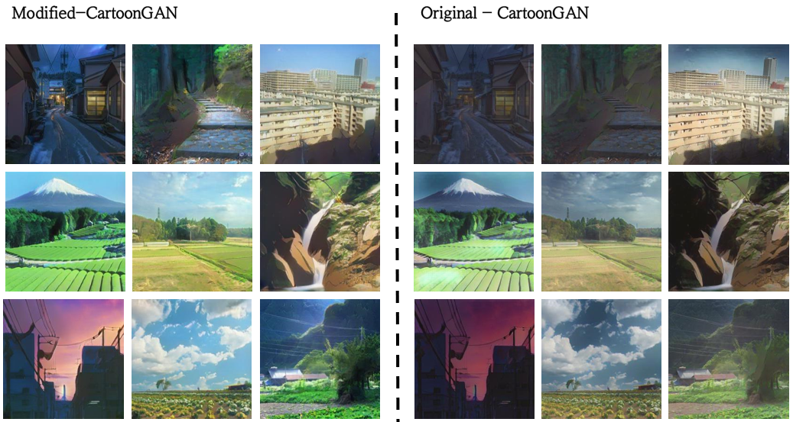
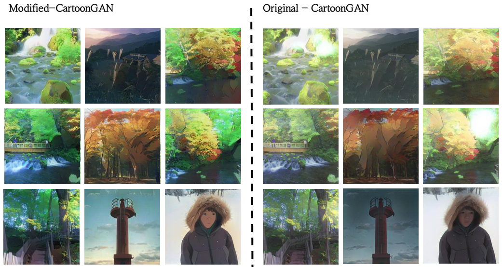

### Images Generated by Our Modified CartoonGAN

Here, we only present images generated with our modified, improved CartoonGAN.

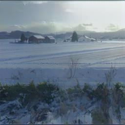
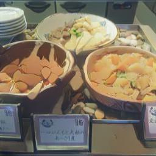
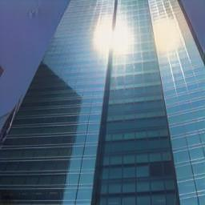
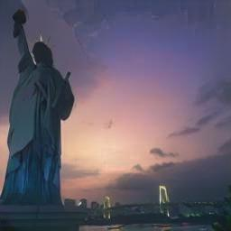
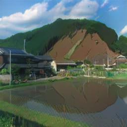
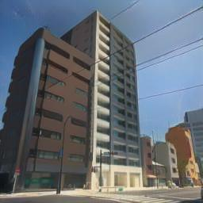
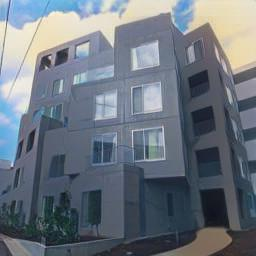
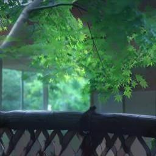

...and some worse generated images...

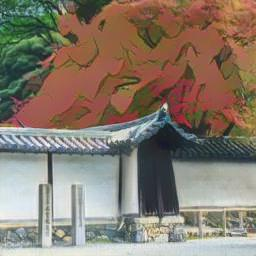
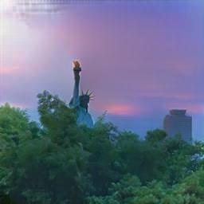
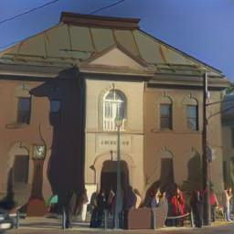

Special thanks to [ML2](https://github.com/kc-ml2) for financial support
