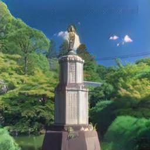

# [CartoonGAN](http://openaccess.thecvf.com/content_cvpr_2018/papers/Chen_CartoonGAN_Generative_Adversarial_CVPR_2018_paper.pdf)

Contributors: [문지환](https://github.com/mnmjh1215), [윤준석](https://github.com/kokookok77), [박수현](https://github.com/suhyunS2), [이유재](https://github.com/yujaelee), [주윤하](https://github.com/YoonHaJoo)

Project for DIYA Meet-up at Aug 4, 2019.

### Goals of this project

1. Implement CartoonGAN and train/test with our data
2. Compare CartoonGAN and CycleGAN
3. Add some components of CartoonGAN to CycleGAN, such as edge smoothed data, and see if image quality improves
4. Further improve CartoonGAN

### Result

[Presentation](./images/meet-up.pdf) (in Korean)

According to FID, CartoonGAN is better than CycleGAN, and our modified CartoonGAN is the best. (FID is smaller if two set of images are similar)

|                           | CycleGAN | CartoonGAN | CartoonGAN-modified |
|---------------------------|----------|------------|---------------------|
| FID with animation images | 108.69   | 100.30     | 95.50               |
| FID with photo images     | 76.13    | 80.96      | 81.91               |

#### Images

Here, we only present images generated with our modified, improved CartoonGAN.

...and some worse generated images...

